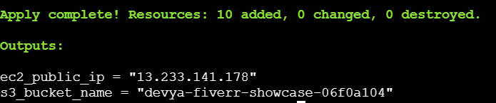
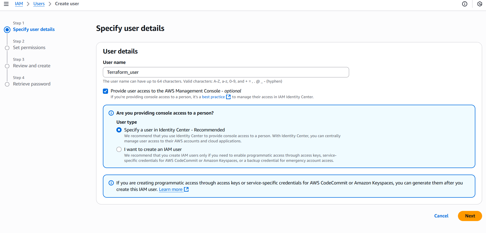
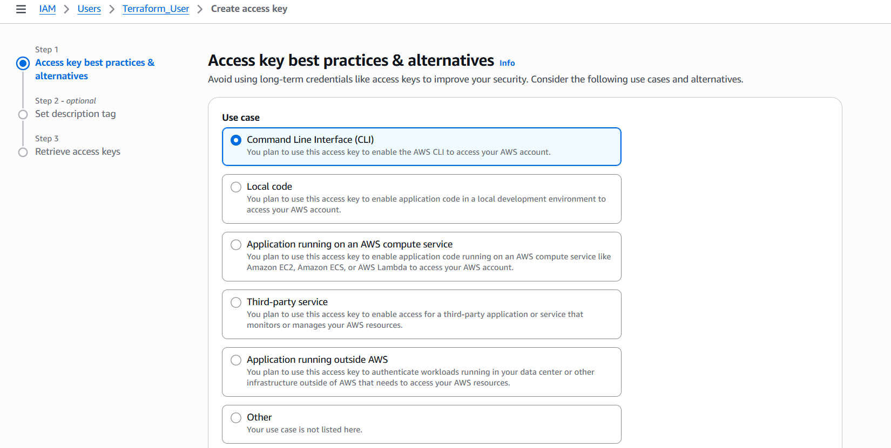
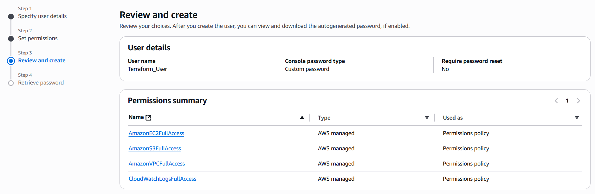

# 🚀 AWS Infrastructure with Terraform (EC2 + VPC + S3)

This project provisions a simple and secure AWS infrastructure using Terraform.

✅ EC2 Instance with Nginx  
✅ Custom VPC, Subnet, IGW  
✅ S3 Bucket with Versioning  
✅ Modular Terraform Code  
✅ AWS IAM User with Proper Permissions  
✅ Output screenshot and AWS user creation steps included

---

## 📦 Tech Stack

- ✅ Terraform v1.x
- ✅ AWS CLI
- ✅ Ubuntu EC2
- ✅ GitHub

---
##AWS IAM User Creation :






## ⚙️ AWS CLI + Terraform Installation (on EC2)

```bash
# Install AWS CLI
sudo apt update -y
sudo apt install unzip curl -y
curl "https://awscli.amazonaws.com/awscli-exe-linux-x86_64.zip" -o "awscliv2.zip"
unzip awscliv2.zip
sudo ./aws/install
aws --version

# Configure AWS CLI
aws configure
# Access Key ID
# Secret Access Key
# Region: ap-south-1
# Output: json

# Install Terraform
sudo apt install gnupg software-properties-common -y
curl -fsSL https://apt.releases.hashicorp.com/gpg | sudo gpg --dearmor -o /usr/share/keyrings/hashicorp-archive-keyring.gpg
echo "deb [signed-by=/usr/share/keyrings/hashicorp-archive-keyring.gpg] https://apt.releases.hashicorp.com $(lsb_release -cs) main" | \
sudo tee /etc/apt/sources.list.d/hashicorp.list
sudo apt update -y
sudo apt install terraform -y
terraform -v
